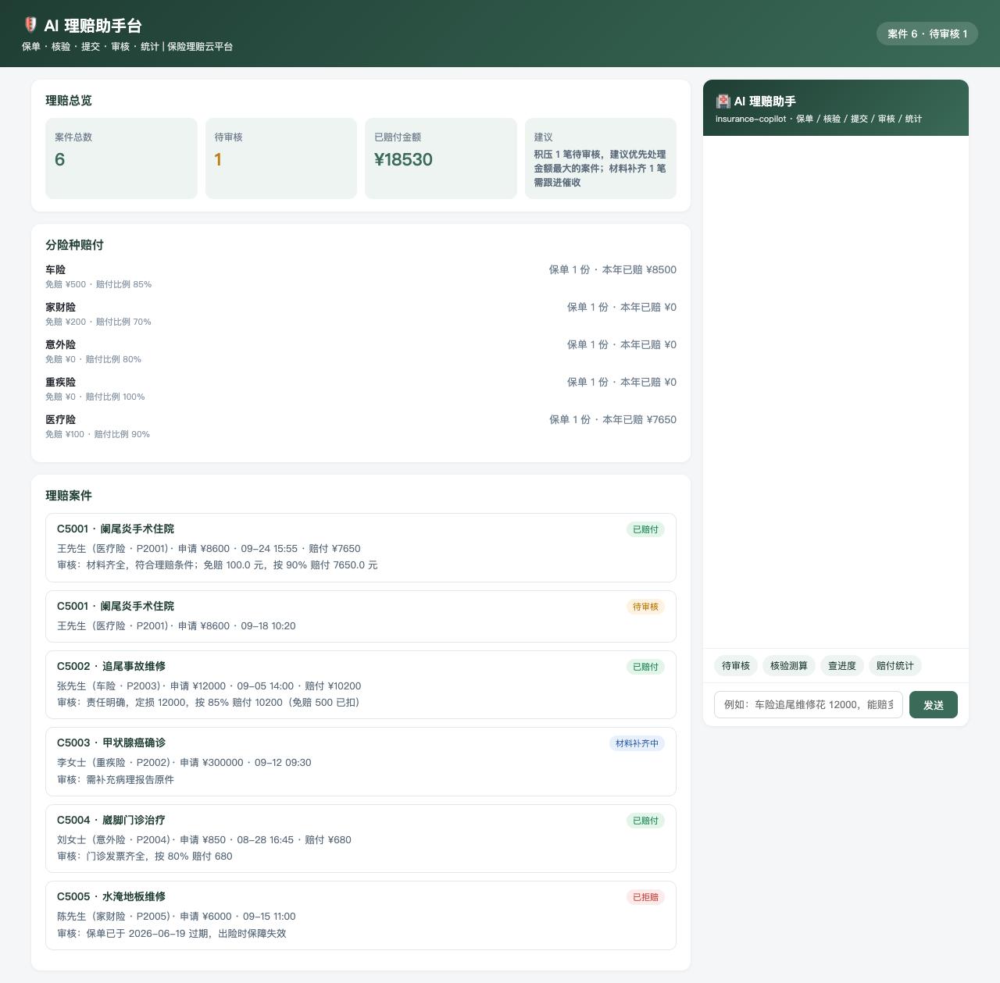
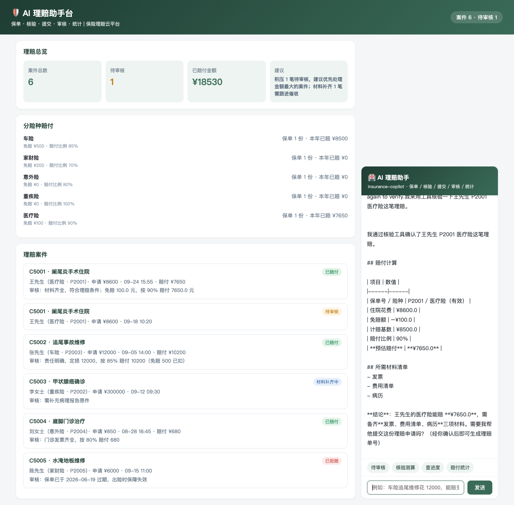
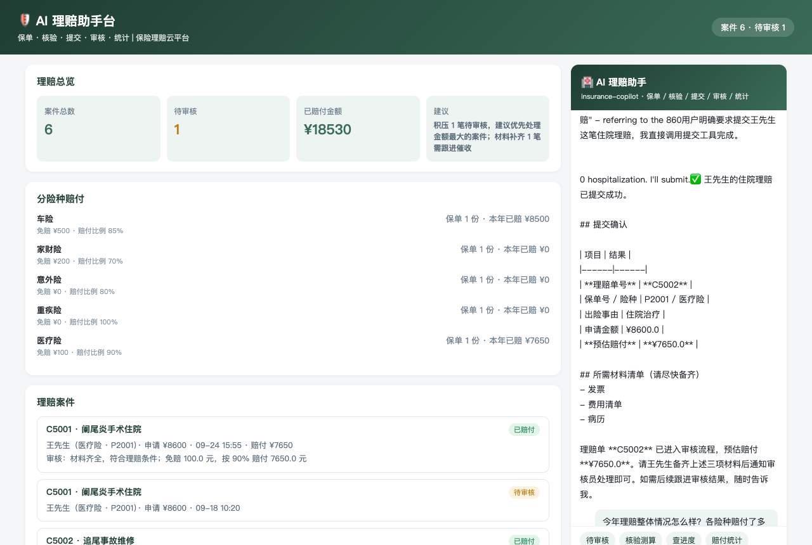
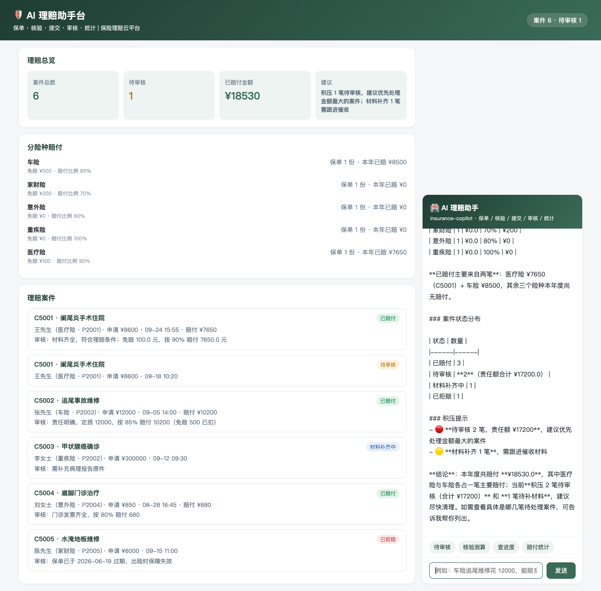

# AI 理赔助手台 · 使用说明

> 面向投保人/理赔审核员/客服的操作手册。左侧是理赔总览、分险种赔付与案件列表，右侧 AI 助手用自然语言查保单、核验测算、提交理赔、审核、看统计。

## 一、页面导览

打开 `http://127.0.0.1:18097/`：

1. **顶部横幅**：案件总数与待审核数一眼看清。
2. **理赔总览**：案件总数 / 待审核 / 已赔付金额 / 处理建议（如「积压 1 笔待审核，建议优先处理金额最大的案件」）。
3. **分险种赔付**：5 险种保单数、本年已赔、免赔额与赔付比例。
4. **理赔案件**：单号/事由/状态标签（待审核/已赔付/材料补齐中/已拒赔）/投保人/申请金额/审核意见。
5. **AI 理赔助手**（右侧面板）：快捷提问（待审核/核验测算/查进度/赔付统计）+ 输入框，SSE 流式回答。

## 二、AI 能干什么（对应 5 个工具）

| 你说的话 | AI 做的事 | 背后工具 |
|----------|-----------|----------|
| "我的保单/王先生的保险" | 列保单明细与保障期状态 | `policy_list` |
| "住院花 8600 能赔多少" | 核验保单有效性，算免赔与比例，报预估赔付与材料 | `claim_check` |
| "帮我提交理赔" | 复述核验结论二次确认后提交，报理赔单号 | `claim_file` |
| "C5001 批一下/为什么拒赔" | 复述案件要素后审核，通过必报赔付计算 | `claim_adjust` |
| "今年赔付多少/有积压吗" | 案件分布/赔付支出/分险种/处理建议 | `stats` |

## 三、典型对话示例

**例 1 · 核验测算**

> 你：王先生住院花了 8600，他的医疗险能赔多少？
> AI：P2001 医疗险（有效）。**预估赔付 =（8600 − 免赔 100）× 90% = ¥7650**。需备齐：发票、费用清单、病历。

**例 2 · 提交理赔**

> 你：帮我把这笔住院理赔提交上去
> AI：请确认：P2001 · 阑尾炎手术住院 · ¥8600 · 预估赔付 ¥7650。确认后提交。
> 你：确认
> AI：✅ 提交成功！**理赔单号 C5002**，状态「待审核」，请尽快备齐三项材料。

**例 3 · 拒赔解释**

> 你：陈先生的家财险水淹理赔为什么被拒了？
> AI：C5005 已拒赔——**P2005 保单已于 2026-06-19 过期**，出险时保障失效。如需继续保障建议尽快续保。

## 四、回答规则（系统提示词已内置）

1. 核验必须给出**赔付计算过程**（花费 − 免赔额 → × 赔付比例），并说明所需材料。
2. 提交与审核前必须**复述案件要素并获确认**；结果必报理赔单号。
3. 审核通过必报**赔付金额与计算依据**；拒绝必须说明依据（保单过期/等待期/超限/材料缺失）。
4. 保单过期或无效时明确告知**不能理赔**并建议续保。
5. 数据全部来自工具返回，禁止编造保单与赔付金额。

## 五、常见问题

**Q：赔付金额怎么算的？**
赔付 =（申请金额 − 免赔额）× 赔付比例，且不超过该险种单次上限。各险种比例：医疗险 90%、重疾险 100%、意外险 80%、车险 85%、家财险 70%。

**Q：什么情况会被拒赔？**
四类原因：① 保单过期或无效（出险不在保障期）；② 等待期内出险；③ 超单次/年度赔付上限；④ 材料不齐。AI 会逐条说明。

**Q：材料补齐中是什么状态？**
审核员要求补充材料（如病理报告原件），补齐后案件继续审核，不影响此前核验结论。

**Q：AI 没反应？**
确认 DSH 服务（127.0.0.1:8090）在运行、`insurance-copilot` 插件处于 ACTIVE 状态，见 README「快速开始」。
